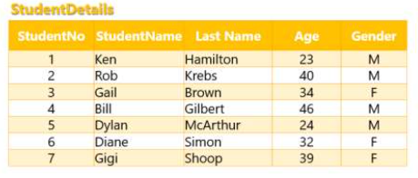
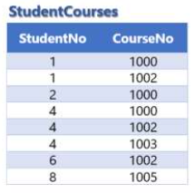
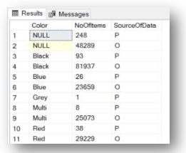
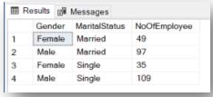
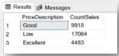

# Week 2  
- [4. Grouping & Aggregation](#4-grouping--aggregation)  
- [5. Advanced Filtering](#5-advanced-filtering)  
- [6. Diagram & Join Tables](#6-diagram--join-tables)
- [7. Union & Conditions](#7-union--conditions)  
  
## 4. Grouping & Aggregation  
### Part 1 - GROUP BY Keyword

1. How much income (SubTotal) was there in 2012 (OrderDate)? Instruction: Write a query that answers the question, is based on the `Sales.SalesOrderHeader` table and filters the data by year. (Use the function YEAR().)  
```sql
select SUM(SubTotal) as 'income'
from Sales.SalesOrderHeader
where year (OrderDate) = 2012
```

2. How much income (`SubTotal`) was there in 2013 (`OrderDate`)? Instruction: Write a query that answers the question, based on the `Sales.SalesOrderHeader` table.  
```sql
select SUM(SubTotal) as 'income'
from Sales.SalesOrderHeader
where year(OrderDate) = 2013
```
  
3. Examine the results of the 2 previous questions and answer the following:
    a. Was there a rise or drop in sales?
    b. Think what the causes for this may be(based on your general knowledge and life experience).  
```
Answer:
A. There was an increase in sales in 2013, compared to 2012.
B. The reason could stem from better marketing, for example
```

4. Write a query that displays the amount of orders made by each customer (CustomerID). Use the `Sales.SalesOrderHeader` table. Instruction: Write a query that groups the data in the Sales.`SalesOrderHeader` table according to Customer ID and displays the Customer ID and a count of the number of orders. Give a significant name to the column with the number of orders per customer.  
  
```sql
select	CustomerID,
		COUNT (*) as NoOfOrders
from Sales.SalesOrderHeader
group by CustomerID
```
  
5. Continuing from the previous question,sort the query results according to the number of orders from the highest to the lowest.  
```sql
select	CustomerID,
		COUNT (*) as NoOfOrders
from Sales.SalesOrderHeader
group by CustomerID
order by NoOfOrders desc
```

6. Continuing from the previous question,add code so that the query will run only on the orders with Order Date 2013.
```sql
select	CustomerID,
		COUNT (*) as NoOfOrders
from Sales.SalesOrderHeader
where YEAR(OrderDate) = 2013
group by CustomerID
order by NoOfOrders desc
```

7. Write a query that displays descriptive statistics foreach Color from the Production.Product table : quantity of items of the same color, maximum list price, average list price, minimum list price, Instruction: Write a query that retrieves data from the Production.Product table, and groups it by Color field. Display the color code, and the appropriate aggregate functions. Be sure to give significant, comprehensible names to the calculated columns.  

8. Continuingfromthepreviousquestion,examinetheresults.Notethatthereare colors for which the minimum price is 0. Since a product cannot have a price to the customer of 0, copy the query and add a filter to it, so that lines with List Price 0 will not be included in the calculation.  

9. Continuingfromthe2previousquestions,usethemousetoselectthecodesof both queries and run them together. Note that both results will appear in the Results window. These are the corresponding query results. Examine the Average Price column for the colors that had a minimum price of 0. Are there discrepancies in the average? Pay attention to this is a very important point! Sometimes we must filter out data that skew the calculations. Therefore, it is important to verify the data and the results. This is a significant part of the analyst’s job: critical thinking.  

10. What is the most common Last Name in the Person.Person table Instruction: Write a query that shows how many times the same last name repeats for each Last Name in the Person.Person table. Sort the results according to the number of repetitions of the last name in descending order.Hint: Use “Group by” and pay attention to how many fields you choose to display in the query (Select).

11. Examine the Order details (Sales.SalesOrderHeader) for 2012. Check the following in the Total Payment for Order field (SubTotal):
  a. What is the highest Order amount? 
  b. WhatisthelowestOrderamount? 
  c. What is the average Order amount? 
  d. WhatisthetotaloftheOrders?
  e. Howmanyorders(separaterecordsinSales.SalesOrderHeader)were issued?
### Part II - Having clause
1. WriteaquerybasedontheSales.SalesOrderDetailtable,thatcountshowmany rows there are in each order (SalesOrderID). Display the Order number, and the quantity of lines in the order. Display data only for orders that have more than 3 lines.  

2. WriteaquerybasedontheSales.SalesOrderDetailtable,thataddsuptheLine Total for each order (SalesOrderID). Display the Order number, and the Total for Payment for orders that have a Total for Payment above 1000.  

3. Howmanycustomersmademorethan20orders?(Eachrowinthe Sales.SalesOrderHeader table represents an order.) Instruction: Write a query based on the data in the Order details table (Sales.SalesOrderDetail) that groups the data according to CustomerID. Add a filter after aggregation, such that only the rows with a Count higher or equal to 20 will be displayed.  

4. Whichjobsinthecompany(JobTitle)have10employeesormoreinthesame job? Display the list of Jobs (JobTitle) that answer the criteria and the number of employees in that job. Base your answers on the HumanResources.Employee table. Instruction: Write a query that displays the Job Titles and the number of employees in each job from the HumanResources.Employee table. Add a filter that will display only the jobs with 10 employees or more.  

5. WriteaquerybasedontheSales.SalesOrderDetailtablethatdisplaystheamount of each product ordered only for products with an amount above 50 units Instruction: Write a query based on the Sales.SalesOrderDetail table. The query groups the data according to Product ID and calculates the total number of items ordered for each item. (Pay attention to which aggregate function you are using and on which field. Use ERD.)  
  
6. WriteaquerythatdisplaystheLastnamesfromthePerson.Persontablefor people whose last name appears 100 times or more in the Person.Person table.  
  
7. WriteaquerythatdisplaystheCustomerIDandtotalpurchaseamount(SubTotal) for customers who purchased a total amount over 100,000 in 2012 (all the orders in that year). Base your answer on the Sales.SalesOrderHeader table.  
  
8. Write a query based on the Sales.SalesOrderDetail table that displays the Order number and the number of lines in each order only for orders with more than 3 lines and Order numbers between 45,000 and 50,000, inclusive. Instruction: Before you begin writing the query, examine the columns and data in the Sales.SalesOrderDetail table.  
  
9. WriteaquerybasedonthePerson.PersontablethatdisplaystheLastnamesand the number of appearances of that name. Display only the Last names that appear between 10 and 50 times.

## 5. Advanced Filtering  
### Part 1 – SELECT DISTINCT, SELECT TOP  
1. Copyandrunthefollowingqueries.Whatisthedifferencebetweentheresults?
    a. Query 1:
    ```sql
    select ProductSubcategoryID
    from Production.Product
    ```
    b. Query2:
    ```sql
    select distinct ProductSubcategoryID
    from Production.Product
    ```
2. Writeaquerythatdisplaysthe5firstDepartmentnamesfromthe HumanResources.Department table.

3. Writeaquerythatdisplaysallthedetailsofthe20productswiththehighestcost (StandardCost) from the Production.Product table.  

4. WriteaquerythatdisplaysthelistofColorsoftheproductsfromthe Production.Product table, where each color appears only once.  

5. Displaythe10itemswiththelowestListPriceintheProduction.Producttable.Do not include items without a price (i.e., Price = 0).  

6. Whatdoesthefollowingquerydo?  

```sql
select distinct top 5 Color
from Production.Product
```

7. Displaythe10Customernumbers(CustomerID)andOrdertotals(SubTotal)for the customers with the highest order amounts in 2012 (OrderDate). Base your answer on the Sales.SalesOrderHeader table.  

8. Challengequestion:  What is the number of unique (non-repeating) cities in the Person.Address table?  

9. Whicharethe10orderswiththehighestamounts(SubTotal)in2013(OrderDate)? Instruction: Figure out how to ensure that the highest amounts will be at the top?  
  
10. What does the following query return?  
```sql
select distinct top 10 FirstName
from Person.Person
order by FirstName
```

### Part 2 – IN, BETWEEN OPERATORS, LIKE & Aliases  
1. DisplaythenamesofthepeopleinthePeopletablethathaveoneofthefollowing Last names: Adams, Kelly, Perry, Wilson. Use the “IN” operator.

2. Writeaquerythatdisplaystheproductcode(ProductID),theProductnameand the subcategory code (ProductSubcategoryID) from the Production.Product table, Display the data only for products for which the subcategory is one of the following: 2,5,9,14,15,30. Sort the data by subcategory  
  
3. Writeaquerythatdisplaystheproductcode(ProductID)andproductcost (StandardCost) from the Production.Product table for products with a cost between 100 and 500,  
  
4. Writeaquerythatshowstheordernumber(SalesOrderID),orderdate (OrderDate) and total for payment (SubTotal), for orders generated on the dates 10/01/2012 to 10/02/2012, inclusive . Base your answer on the Order title table. * The dates in the question are written in dd/mm/yyyy format.  
  
5. Writeaquerythatdisplaystheproductcode(ProductID),theproductnameand the Product number for all the products in the Production.Product table that begin with the letter “C”.  
  
6. Writeaquerythatdisplaystheproductcode(ProductID),theproductnameand the Product number for all the products in the Production.Product table that begin with the letters “C”, “B” or “E”.  
  
7. Writeaquerythatdisplaystheproductcode(ProductID),theproductnameand the Product number for all the products in the Production.Product table that end with the number “8”.  
  
8. DisplaytherecordsfromthePerson.Addresstablewiththeword“New”intheir Address 1 line (beginning/middle/end).  
  
9. DisplaytheFirstnamesofthepeopleinthePerson.PersontablewheretheFirst name has only 5 letters, the first letter is “D” and the third letter is “N”. Display the names without repetition.  
  
10. Write a query that displays the data from the Sales.SalesOrderDetail table where the total per line (LineTotal) is between 1,000 and 5,000 (use “Between”) and the Carrier Tracking Number contains the sequence F89. Sort the results by Unit price in ascending order.  
  
11. Write a query that displays the product code (ProductID) and product name from the Production.Product table for all the products that have the word “Red” in their name and their List Price is between 600 and 1,500, inclusive.  

### Part 3 – IS NULL

1. WriteaquerythatdisplaystheproductdetailsoftheproductswiththecolorNULL from the Production.Product table. Check the table for the appropriate column name  

2. WriteaquerythatdisplaysalltheorderdetailsfromtheSales.SalesOrderHeader table for the orders that have data in the Sales Person ID column.  

3. Writeaquerythatdisplaysthecustomercodeandthehighestorderamount (SubTotal) in the years 2012 and 2013 for each customer in the Sales.SalesOrderHeader table. Display only sales that have values both in the Sales Person column, and in the Purchase Order Number column. Check the table for the appropriate column names.  

## 6. Diagram & Join Tables
### Part 1–Database Diagram
1. Whichcolumnconnectsthefollowingtables? Instruction: For each row in the table, open a diagram and insert Tables 1 and 2 into it. Check the name of the connecting column in each table and write the name in the appropriate place in the question.

| Table 1 Name | Connecting Column in Table 1 | Table 2 Name | Connecting Column in Table 2 |   
| ----- | --- | --- | --- |   
| Sales.SalesPerson |   |  Sales.Store |  |  
| Production.TransactionHistory |  | Production.Product |  |  
| Production.BillOfMaterials |  | Production.Product |  |  
| Person.Person |  | Person.BusinessEntity |  |  

2. Look at the Person.Address and Person.BusinessEntityAddresstables.
  a. What is the connection between them? How can they be connected?
  b. What is the significance of the data in each of the tables?
  
### Part 2–Basics: Join, Left Join, Right Join, Full Outer Join  
 
1. Below are 2 tables from the database of the Analyst in the Making College.  


  
  

2. Look at the data in the tables and try to understand the following:  
  a. What does each table represent? What is significant about the content?
  b. Is there a connection between the tables? What is it?  

3. Take paper and pen and try to arrive at the query results manually. Write down the results.  
    a. JOIN / INNER JOIN:
```sql
select s.StudentNo, c.CourseNo
from StudentDetails s
inner join StudentCourses c
on s.StudentNo = c.StudentNo
```  

  b. LEFT JOIN:  

```sql
select s.StudenNo, c.CourseNo
from StudentDetails s
left join StudentCourses c
on s.StudentNo = c.StudentNo
```  
  
  c. RIGHT JOIN:  

```sql
select s.StudentNo, c.CourseNo
from StudentDetails s
full outer join StudentCourses c
on s.StudentNo = c.StudentNo
```
4. What is the significance of the results of the following query?

```sql
select COUNT(*) as WhatIsMyMeaning
from StudentCoursescr s
join StudentDetails dtl
on crs.StudentNo = dtl.StudentNo
Where dtl.Gender = 'F'
```

### Part 3– Join, Left Join, Right Join, Full Outer Join  
General Instructions:
Use the diagram, as you were taught, or the reference pages, 1-SQL-0-AdventureWorks ERD Tables Reference
1. WriteaquerythatlinkstheSales.SalesOrderHeadertabletothe Sales.SalesOrderDetail table and displays all the columns from both tables.
2. WriteaquerythatlinkstheSales.SalesOrderDetailtabletotheProduction.Product table and displays the following columns: SalesOrderID, ProductID, Name, ProductNumber, and LineTotal.
Think which table should be used to display the ProductID column.
3. Inthisquerywewillexaminetheprofitabilityofeachorderrecord:
Write a query that links the Sales.SalesOrderDetail table to the Production.Product table and displays the following columns: SalesOrderID, ProductID, LineTotal, StandardCost, OrderQty, and the profit per order record (calculated column).
4. WriteaquerythatlinkstheSales.SalesOrderHeadertabletothe Sales.SalesOrderDetail table and displays the following columns: SalesOrderID, OrderDate, ProductID, and LineTotal.
Display only the details of the orders from 2012.
5. WriteaquerythatlinkstheSales.SalesOrderDetailtabletotheProduction.Product table.
a. Display the following columns: SalesOrderID, ProductID, and Name. Display only the details of the products for which the color is "Null".
b. MusttheColorfieldbeselectedintheSelectsectionInordertofilterthe data according to color?
c. If the columns are not displayed, how can the correctness of the results be verified?
6. WriteaquerythatlinksbetweentheSales.SalesOrderDetailtable,the Production.Product table and the Sales.SalesOrderHeader table and displays the following columns: SalesOrderID, OrderDate, ProductID, Color and LineTotal.
7. Writeaquerythatdisplaysthequantityofproductsorderedeachyear.
Instructions: Write a query that links the Sales.SalesOrderDetail table to the Sales.SalesOrderHeader table and groups the data according to year (in a column calculated from the OrderDate field). The query will display the following columns: Year and OrderQty.
8. WriteaquerythatdisplaystheProductIDandLineTotalonlyforordersfrom2011 in which the total paid (LineTotal) is greater than 1,000. (Calculate the date from the OrderDate column.)
9. Writeaquerythatdisplaysthecustomerdetailsofeachorderinthe Sales.SalesOrderHeader table, The following columns should be displayed: SalesOrderID, Order Date, CustomerID, First Name, Last Name, and SubTotal.
Sort the data by last name and then by first name.
Instruction: Check in ERD which are the relevant tables and what are the relationships between the tables.
  
10. Read the following query and explain what it does: (Don't run it in SSMS.)

```sql
select p.ProductID, p.ProductSubcategoryID, c.[Name]
From Production.Product
left join Production.ProductSubcategory c
on p.ProductSubcategoryID = c.ProductSubcategoryID
```  

11. Read the following queries: (Don't run them.)  
  a. What will the following query return? Will there be one record or more in the results?  

    ```sql
    select prd.ProductID
    from Production.product prd
    where prd.ProductID = 921
    ```
  b. Lookatthefollowingquery Notethatthisqueryisbasedonthequeryfrom the previous section, but with an extra link to the Sales.SalesOrderDetail table. What will the query return? Will one record or more appear in the query results? Why?

  ```sql
  select prd.ProductID,
  prd.[Name],
  sod.SalesOrderID
  from Production.product prd
  join Sales.SalesOrderDetail so
  on sod.ProductID = prd.ProductID
  where prd.ProductID = 921
  ```

12. In order to send marketing mailings to customers, write a query that displays the following data for each BusinessEntityID from the Person.BusinessEntityAddress table, by linking to the Person.Address table: BusinessEntityID, AddressLine1, AddressLine2, City, StateProvinceID.

13. Continuing from the previous question, can the First and Last Names be added, as well? If so, link the table and add the relevant columns to the query results.  
  
14. Write a query that displays the customer code and the highest order amount (SubTotal) in 2012 and 2013 for each customer from the Sales SalesOrderHeader table, Display only the orders with values in both the salesman column and the PurchaseOrderNumber column. Check the names of the appropriate columns in the table.  

## 7. Union & Conditions  
### Part 1–Union, Union All

1. Write a query that returns a single list of all customer numbers from the `Sales.Customer` table and sales people from the `Sales.SalesPerson` table. Check the names of the appropriate columns in the table.  
```sql
select BusinessEntityID
from Sales.SalesPerson
union
select CustomerID
from Sales.Customer
```

2. Write a query that displays the `ProductID` for the products that meet at least one of the following requirements. If the item meets more than one requirement, the product code should be displayed only once. Solve with **union only**:  
  a. The product was ordered (Sales.SalesOrderDetail) at a unit price after discount (calculated using the existing columns) greater than 1800, and the CarrierTrackingNumber starts with the letters 4E.
  b. The order record is for a quantity of product greater than 10 units and the tracking number ends with the number 4.  
```sql
select distinct ProductID
from Sales.SalesOrderDetail 
where	(LineTotal/OrderQty) > 1800 and 
		CarrierTrackingNumber like '4E%'
union 
select distinct ProductID
from Sales.SalesOrderDetail 
where	OrderQty > 10 and 
		CarrierTrackingNumber like '%4'
```

3. In the following query,we want to compare the quantity of products of each color in the product table to the quantity of items of each color ordered, in order to understand which colors are ordered most by customers.  
  a. The query will return 3 columns: Color, number of items (a calculated column named NoOfItems), and the data source (a calculated column named SourceOfData).
  b. The query will return a single row for each color from the product table. The row will contain the color, the number of products of that color and the constant text 'P', to show that the data came from the product table.
  c. In addition, the query will return one row for each color from the Sales.SalesOrderDetail table. The row will contain the color, the number of products of that color ordered and the constant text 'O', to show that the data came from the orders table.
  d. Sort the results according to color code.
  e. Following is a screenshot of the beginning of the query results for reference:  
  

```sql
select	Color,
		COUNT (*) NoOfItems,
		'P' SourceOfData
from Production.Product
group by Color
union
select	Color,
		SUM (d.OrderQty),
		'O' SourceOfData
from Sales.SalesOrderDetail d
	join Production.Product p
		on d.ProductID = p.ProductID
group by Color
order by Color
```
  
### Part 2–Case When

1. Write aquery based on the `Person.Persontable`,that displays the following data:
  • First name
  • Last name
  • A column named TitleEdited that will contain the following data:
  If there is a value in the Title column, it will display it, and if there is no value, it will display "No Title".

```sql
--ANSWER GOES HERE
```

2. Write a query based on the `Production.Product` table, that displays the following data:
  • ProductID
  • Name
  • A column named StyleEdited that will contain the information to whom the model is suited, according to the value in the Style column and the following key:
    a. M →Man
    b. W→Woman 
    c. U → Unisex
    d. No value→Accessories

```sql
--ANSWER GOES HERE
```

3. Write a query that ranks each row in the `Sales.SalesOrderDetail` table, and displays the following data: SalesOrderID, OrderQty, Group Code (details below). The Group code will be based on the value that appears in the Order Quantity column, and the following key:
  a. up to one item = D
  b. 2-5 items (inclusive) = C
  c. 6-30 items (inclusive) = B
  d. more than 30 = A

```sql
--ANSWER GOES HERE
```

4. Challenge question (Continuation from the previous question) The previous query produced a list of all the order records with the rank of each record according to the quantity of items ordered. Now, we want to refine the display to see how many times each group code appears. To do this, write a query that shows how many times each group code (A, B, C, D – according to the data in the previous question) appears in the `Sales.SalesOrderDetail` table. Instruction: Look at the results of the previous query, and think how the answer could be calculated manually.  

```sql
--ANSWER GOES HERE
```
  
5. Inordertosegmentemployeesaccordingtogenderandmaritalstatus,writea query based on the HumanResources.Employee table that shows the number of employees in each segment of gender and family status. To make the results clearer, use the following key to change the displayed data:
  a. Gender column:
    • F→Female 
    • M→Male
  b. MaritalStatuscolumn:
    • S→Single
    • M→Married
    • Any other value→Other

    Note: Currently the values in this column are only 'S' or 'M', but since there are other family statuses (e.g., widowed, divorced, etc.), the query shoud support the other options and classify them as 'other'.

  c. Following is a preview of the results:  
  

```sql
--ANSWER GOES HERE
```
6. Write a query that displays the SubTotal of every order from the OrderHeader table according to the following rules:
    a. All orders under 1000 → Low
    b. Allordersof1000ormore,butlessthan3000→Good c. All other orders → Excellent

```sql
--ANSWER GOES HERE
```    

7. Challenge question: Continuing from the previous question, now display how many orders of each price type there are. Instruction: Before you start solving it, think about the way you would solve it if you were doing it manually. Following is a preview of the results:

  

```sql
--ANSWER GOES HERE
```
  