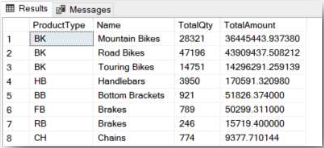
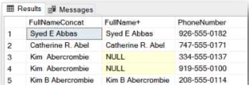
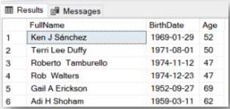
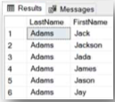
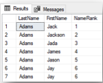
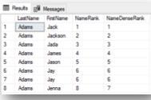
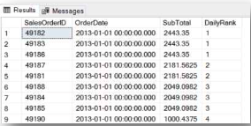
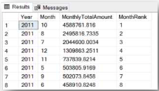
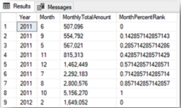

# Week 3  
- [8. Built-in & Window Functions](#8-built-in--window-functions)  
- [9. Unrelated Nested Queries](#9-unrelated-nested-queries)  
- [10. Related Nested Queries](#10-related-nested-queries)
- [11. Common Table Expressions](#11-common-table-expressions)  

## 8. Built-in & Window Functions   
### Part 1: Built-in Aggregate Functions, Built-in Functions on Number, String and Date Fields  
  
1. What is the maximum `OrderQty` that was ordered in one order record in the `Sales.SalesOrderDetail` table?  

2. How many different products (ProductID) were ordered in 2012? Base your answer on the `Sales.SalesOrderDetail` and `Sales.SalesOrderHeader` tables.  
  
3. How many letters are there in the longest `FirstName` in the `Person.Persontable`?  
  
4. In order to analyze the orders,write a query that displays the following data for each order in the `Sales.SalesOrderHeader` table: `SalesOrderID`, `OrderDate`, the year of the order, the month and the day of the week.  
  
5. Which day of the week has the highest number of orders? In order to check the distribution of orders over the days of the week, write a query that shows how many orders were generated on each day of the week. Sort the results in descending order. Instruction: Take the data from the `Sales.SalesOrderHeader` table. Use the function and operations that were taught in the lesson.  
  
6. Which day of the week has the highest order amount? Write a query that displays the total order amount for each day of the week Instruction: Take the data from the `Sales.SalesOrderHeader` table. Use the function and operations that were taught in the lesson.  

7. Continuing from the two previousquestions is there a correlation between the number of orders each day of the week and the profitability on that day? If there are differences in the results of the query, what can cause this difference?  
  
8. Write a query,based on the product and order detail stables,that displays the product type (a calculated field – will be defined later), the number of items ordered and the LineTotal for each type of product.Product type definition: ProductType is a calculated field, designated by the two left characters in the ProductNumber column. For example:
  
| | ProductType | ProductNumber |  
| --- | --- | --- |  
| 1 | AR | AR-5381 |  
| 2 | BA | BA-8327 |  
| 3 | BB | BB-7421 |  

9. Continuing from the previous question,in order to understand each product type, link the data to the `Production.Product` Subcategory table. Start out from the previous query and add the Name column from the Subcategories table. 
  
  Instruction: Examine the query, and consider how to add the Name column to the display so that the query will abide by the syntax rules that were taught. 
  
  Preview of the results:

  

10. To be able to send marketing mailings to customers and employees, display thefull name from the `Person.Person` table and the PhoneNumber listed in the `Person.PersonPhone` table. Note that the full name consists of: `FirstName`, `MiddleName`, `LastName`, and should appear in one column that connects the three columns. Define the full name column in the two ways that were taught. Examine the results and determine which way is the correct solution.  
  
  Preview of the results:

 
  
11. Starting from the `HumanResources.Employee` table, link the `Person.Person` table to it, and display the following columns for each employee: Full name of the employee (in the preferred method from the previous question, concat function), date of the employee's birthday (BirthDate) and employee's age today. (Today = the day the query is run.) Preview of the results: (The dates that appear are correct for the query run on 05/09/2021, in dd/mm/yyyy format.)  
  
  
  
### Part 2–Window Functions  
  
1. Introductory Question: Display the last names and first names of all the people who have the last name Adams and a first name that starts with the letter J. Sort the data by last name + first name. Base your answer on the person.person table. 
  
  A preview of the results:

  
  
2. Continuing from the previous question,add a column called `NameRank` in which you rank the results so that for each last name there is an internal ranking according to the alphabetical order of the first names.  
  
  A preview of the results:

   
  
3. Continuing on copy the query and add another column called `NameDenseRank` in which you rank the results with the `DENSE_RANK` function, so that for each last name, there is an internal ranking according to the alphabetical order of the first name. Examine the differences in the results between `RANK` and `DENSE_RANK`. 
  
  A preview of the results:  
  
    

4. Display the orders generated on the dates `01/01/2013-02/01/2013`, based on the Order heading table. Rate each day's orders from the order with the highest SubTotal amount (rating 1) to the lowest. If there are orders with identical amounts, they receive the same rating, and then the rating continues from the next number.

  A preview of the results: 
  
   
  
5. Write a query that displays a line for each month of the year (i.e.,a line for each of the months: January 2011, February 2011 ... January 2012, February 2012...), and rank the months of each year separately according to the total sales (SubTotal) in that month. (2011 has its own ranking, and the ranking starts again for 2012.) Sort the query results by year, and ranking.  
  
  A preview of the results:

6. Continuing from the previous question,copy the query code,replace the ranking function with the `percent_rank()` function and run the query. (This function does not turn pink, which is fine.) Replace the sorting within the ranking to ascending. What is the significance of the ranking? A preview of the results:  

## 9. Unrelated Nested Queries    
## 10. Related Nested Queries  
## 11. Common Table Expressions
  
