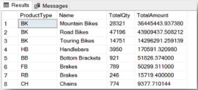

# Week 3  
- [8. Built-in & Window Functions](#8-built-in--window-functions)  
- [9. Unrelated Nested Queries](#9-unrelated-nested-queries)  
- [10. Related Nested Queries](#10-related-nested-queries)
- [11. Common Table Expressions](#11-common-table-expressions)  

## 8. Built-in & Window Functions   
### Part 1: Built-in Aggregate Functions, Built-in Functions on Number, String and Date Fields  
  
1. What is the maximum `OrderQty` that was ordered in one order record in the `Sales.SalesOrderDetail` table?  

2. How many different products (ProductID) were ordered in 2012? Base your answer on the `Sales.SalesOrderDetail` and `Sales.SalesOrderHeader` tables.  
  
3. How many letters are there in the longest `FirstName` in the `Person.Persontable`?  
  
4. In order to analyze the orders,write a query that displays the following data for each order in the `Sales.SalesOrderHeader` table: `SalesOrderID`, `OrderDate`, the year of the order, the month and the day of the week.  
  
5. Which day of the week has the highest number of orders? In order to check the distribution of orders over the days of the week, write a query that shows how many orders were generated on each day of the week. Sort the results in descending order. Instruction: Take the data from the `Sales.SalesOrderHeader` table. Use the function and operations that were taught in the lesson.  
  
6. Which day of the week has the highest order amount? Write a query that displays the total order amount for each day of the week Instruction: Take the data from the `Sales.SalesOrderHeader` table. Use the function and operations that were taught in the lesson.  

7. Continuing from the two previousquestions is there a correlation between the number of orders each day of the week and the profitability on that day? If there are differences in the results of the query, what can cause this difference?  
  
8. Write a query,based on the product and order detail stables,that displays the product type (a calculated field – will be defined later), the number of items ordered and the LineTotal for each type of product.Product type definition: ProductType is a calculated field, designated by the two left characters in the ProductNumber column. For example:
  
| | ProductType | ProductNumber |  
| --- | --- | --- |  
| 1 | AR | AR-5381 |  
| 2 | BA | BA-8327 |  
| 3 | BB | BB-7421 |  

9. Continuing from the previous question,in order to understand each product type, link the data to the `Production.Product` Subcategory table. Start out from the previous query and add the Name column from the Subcategories table. 
  
  Instruction: Examine the query, and consider how to add the Name column to the display so that the query will abide by the syntax rules that were taught. 
  
  Preview of the results:

  

## 9. Unrelated Nested Queries    
## 10. Related Nested Queries  
## 11. Common Table Expressions
  
