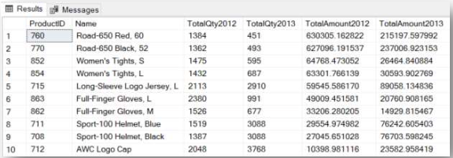
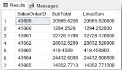
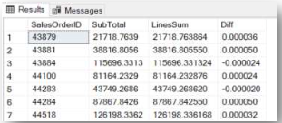
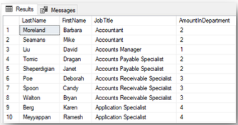

# Week 3  
- [8. Built-in & Window Functions](#8-built-in--window-functions)  
- [9. Unrelated Nested Queries](#9-unrelated-nested-queries)  
- [10. Related Nested Queries](#10-related-nested-queries)
- [11. Common Table Expressions](#11-common-table-expressions)  

## 8. Built-in & Window Functions   
### Part 1: Built-in Aggregate Functions, Built-in Functions on Number, String and Date Fields  
  
1. What is the maximum `OrderQty` that was ordered in one order record in the `Sales.SalesOrderDetail` table?  

```sql
SELECT 
    MAX(OrderQty) AS MaxOrderQty
FROM 
	Sales.SalesOrderDetail;
```

2. How many different products (ProductID) were ordered in 2012? Base your answer on the `Sales.SalesOrderDetail` and `Sales.SalesOrderHeader` tables.  

```sql
select
	count(distinct t1.ProductID) as TotalProducts
from
	Sales.SalesOrderDetail as t1
join
	Sales.SalesOrderHeader as t2
on
	t1.SalesOrderID = t2.SalesOrderID
where
	year(t2.OrderDate) = 2012;
```
  
3. How many letters are there in the longest `FirstName` in the `Person.Persontable`?  

```sql
select 
    max(len(FirstName)) as LongestFirstNameLength
from 
    Person.Person;
```
  
4. In order to analyze the orders,write a query that displays the following data for each order in the `Sales.SalesOrderHeader` table: `SalesOrderID`, `OrderDate`, the year of the order, the month and the day of the week.  

```sql
select
  SalesOrderID, 
  OrderDate,
  datename(weekday, OrderDate) as OrderWeekDay,
  month(OrderDate) as OrderMonth,
  year(OrderDate) as OrderYear
from
  Sales.SalesOrderHeader;
```
  
5. Which day of the week has the highest number of orders? In order to check the distribution of orders over the days of the week, write a query that shows how many orders were generated on each day of the week. Sort the results in descending order. Instruction: Take the data from the `Sales.SalesOrderHeader` table. Use the function and operations that were taught in the lesson.  

```sql
SELECT COUNT(*) AS NoOrders, DATENAME(WEEKDAY,OrderDate) AS 'WeekDay'
FROM Sales.SalesOrderHeader
GROUP BY DATENAME(WEEKDAY,OrderDate)
ORDER BY NoOrders DESC;
```
  
6. Which day of the week has the highest order amount? Write a query that displays the total order amount for each day of the week Instruction: Take the data from the `Sales.SalesOrderHeader` table. Use the function and operations that were taught in the lesson.  

```sql
select	DATENAME (weekday, OrderDate) as SaleDayOfWeek, 
        SUM (SubTotal) SalesAmount
from Sales.SalesOrderHeader
group by (DATENAME (weekday, OrderDate))
order by SalesAmount desc
```

7. Continuing from the two previousquestions is there a correlation between the number of orders each day of the week and the profitability on that day? If there are differences in the results of the query, what can cause this difference?  
  
```sql
--The three most profitable days are also the days when the most orders were generated.
Subsequently, the order differs between the two queries.
This result can be due to the amount of orders.
There may have been a lot of orders on a given day, but each of the orders was for a relatively low amount. 
On the other hand, there may be one day a week with fewer orders, 
but the amounts of all the orders are relatively high, which causes a discrepancy.
```

  
8. Write a query,based on the product and order detail stables,that displays the product type (a calculated field – will be defined later), the number of items ordered and the LineTotal for each type of product.Product type definition: ProductType is a calculated field, designated by the two left characters in the ProductNumber column. For example:
  
| | ProductType | ProductNumber |  
| --- | --- | --- |  
| 1 | AR | AR-5381 |  
| 2 | BA | BA-8327 |  
| 3 | BB | BB-7421 |  

9. Continuing from the previous question,in order to understand each product type, link the data to the `Production.Product` Subcategory table. Start out from the previous query and add the Name column from the Subcategories table. 
  
  Instruction: Examine the query, and consider how to add the Name column to the display so that the query will abide by the syntax rules that were taught. 
  
  Preview of the results:

  

10. To be able to send marketing mailings to customers and employees, display thefull name from the `Person.Person` table and the PhoneNumber listed in the `Person.PersonPhone` table. Note that the full name consists of: `FirstName`, `MiddleName`, `LastName`, and should appear in one column that connects the three columns. Define the full name column in the two ways that were taught. Examine the results and determine which way is the correct solution.  
  
  Preview of the results:

 
  
11. Starting from the `HumanResources.Employee` table, link the `Person.Person` table to it, and display the following columns for each employee: Full name of the employee (in the preferred method from the previous question, concat function), date of the employee's birthday (BirthDate) and employee's age today. (Today = the day the query is run.) Preview of the results: (The dates that appear are correct for the query run on 05/09/2021, in dd/mm/yyyy format.)  
  
  
  
### Part 2–Window Functions  
  
1. Introductory Question: Display the last names and first names of all the people who have the last name Adams and a first name that starts with the letter J. Sort the data by last name + first name. Base your answer on the person.person table. 
  
  A preview of the results:

  
  
2. Continuing from the previous question,add a column called `NameRank` in which you rank the results so that for each last name there is an internal ranking according to the alphabetical order of the first names.  
  
  A preview of the results:

   
  
3. Continuing on copy the query and add another column called `NameDenseRank` in which you rank the results with the `DENSE_RANK` function, so that for each last name, there is an internal ranking according to the alphabetical order of the first name. Examine the differences in the results between `RANK` and `DENSE_RANK`. 
  
  A preview of the results:  
  
    

4. Display the orders generated on the dates `01/01/2013-02/01/2013`, based on the Order heading table. Rate each day's orders from the order with the highest SubTotal amount (rating 1) to the lowest. If there are orders with identical amounts, they receive the same rating, and then the rating continues from the next number.

  A preview of the results: 
  
   
  
5. Write a query that displays a line for each month of the year (i.e.,a line for each of the months: January 2011, February 2011 ... January 2012, February 2012...), and rank the months of each year separately according to the total sales (SubTotal) in that month. (2011 has its own ranking, and the ranking starts again for 2012.) Sort the query results by year, and ranking.  
  
  A preview of the results:


6. Continuing from the previous question,copy the query code,replace the ranking function with the `percent_rank()` function and run the query. (This function does not turn pink, which is fine.) Replace the sorting within the ranking to ascending. What is the significance of the ranking? A preview of the results:  


## 9. Unrelated Nested Queries 

1. Write a query that displays the `ProductID`,the `ListPrice`,and the `averagelistprice` of all the items in the product table.  
  
```sql
```

2. Continuing from the previous question,name the column with the average list price "AverageListPrice". In addition, make sure that the average price list price is calculated only with the items with a list price greater than 0, so as not to skew the result.  
```sql
```
  
3. Write a query that displays the `ProductID` and the `ItemColor` from the `Production.Product` table for the items with the color identical to that of item number 741.  
```sql
```
  
4. Write a query that displays the `BusinessEntityID` and `Gender` of all the employees in the employee table whose gender is the same as the gender of the employee with code 38.  
```sql
```
  
5. Continuing from the previous question, add the first and last names of the employees from the Persons table. Use the diagram or ERD to check which column links the tables.  
```sql
```
  
6. Write a query that displays the orders from the `Sales.SalesOrderHeader` table that have a `SubTotal` lower than the average of the SubTotals of all the orders. Display only the order number.  
```sql
```
  
7. Continuing from the previous question, display how many orders meet the condition.  
```sql
```
  
8. Write a query that displays, the product code, price per item after discount (calculated column), and the difference between the `LineTotal` of each order record and the average of the LineTotals (a calculated column, named DiffFromAVG) for all the records in the order details table.  
```sql
```

9. Continuing from the previous question, write a query that displays the product codes and names of all the products in the products table that were ordered at least once in 2013.  
```sql
```
  
10. Continuing from the previous question, write a query that displays the product codes and names of all the products in the product table where the total quantity ordered in 2013 was at least 300 units.  
```sql
```
  
11. In this query, you must check the quantity and value of orders in 2013, of the ten products with the highest quantity of orders in 2012.In other words, check how the ten products that were ordered the most in 2012 functioned in 2013. (Were they ordered many times? Not ordered at all? Are they still profitable?) Instructions: Write a query that shows the order number, product code, product name, quantity of items in the order, and LineTotal per order record of the products ordered in 2013. The query results should show the data for only the ten best-selling products in 2012. Think which tables and columns are involved in the query. Use the ERD for assistance.  
```sql
```  

12. Challenge Question: Continuing from the previous question, write a query that displays the following data for each of the ten most ordered products in 2012: product code, product name, total quantity of items ordered in 2013 and total order amount in 2013. Think which tables and columns are involved in the query. Use the ERD for assistance.  
```sql
```
    
13. Challenge Question: Continuing from the previous question, write a query showing the total quantity of items ordered and total order amount for 2012 and 2013 of the ten most ordered products in 2012. what can be deduced from the results of the query? (query result attached)  

  
  
```sql
```

14. Challenge Question: An order for a single item is an order that has only one order line. Write a query that displays the SalesOrderID and ProductID of single item orders. Decide which table you should use.  
```sql
```
  
15. Write a query that displays all the products from the products table that were never ordered.  
```sql
```  
  
### Part 2 – Unrelated Nested Queries: A subquery that returns a table (several columns)  

1. Preparationforthenextquestion: Write a query based on the data from the order details table that displays the product code, total quantity ordered, and total amount to be paid (LineTotal) for each product code.  
  
```sql
```

2. Continuing from the previous question, write a query based on the order details and products tables, that displays the following data for each product code: product code, Name, ProductNumber, color, total quantity ordered, LineTotal.Instructions: Write a query that returns the product details from the product table. Also, use the query you wrote in the previous question as a sub-query that returns a table, and link between the two tables using JOIN. Remember, when using a sub-query as a table, the sub-query must be named.  

```sql
``` 
  
3. In this question you must examine the numerical data and their relationship with the order header and order details tables. Question: Does the `SubTotal` column in the order header table contain the sum of all the rows in the `LineTotal` column of the `OrderDetails` table for that same order? Instructions: Write a query, based on the `OrderHeader` and `OrderDetails` tables, that displays the following columns: `OrderNumber`, `SubTotal` from the `OrderHeader` table, total of the `LineTotals` from the `OrderDetails` table. A preview of the results:

  

```sql
```
  
4. Continuing from the previous question,it is difficult to tell from the results whether there are lines with differences between the sums. So we will refine the query: In the query, add a column called Diff, which shows the difference between the total payment from the Order details table and the total payment from the Order header table.  
  
5. Continuing from the previous question, examine the results of the previous query. Note that there are many order lines that do not have any differences, which is great. Add an instruction to the query to display only the lines with a difference (Diff). A preview of the results:  

  
```sql
```
  
6. Continuing from the previous question, examine the results. What is the range of differences? That is, what is the lowest difference and what is the highest difference? To answer this question, simply sort the results of the previous query according to the value in the Diff column.  
```sql
```  
  
  
7. Explanation of the previous questions: As analysts, we research the data. Sometimes we know in advance exactly what we want to check, but in most cases we realize that we can improve the query by adding columns with relevant information, grouping data and schema, adding or changing sorting, etc. only after we get the query results. SQL is a tool aimed at helping us, the analysts, get the information in the most convenient format for analyzing the data. Therefore, when researching topics, be sure to examine the results of your analysis and see if it would be better for you to get the data in a different format. If so, just modify the query accordingly.  
```sql
```  

  
8. Write a query that shows the `ProductID`, `Name`, `ListPrice`, `ProductSubcategoryID` and the difference between the list price and the average list price of all the products in the same sub-category for each product in the Production.Product table. Sort it by subcategory, in ascending order. Include in the calculation of the average list price only products with a `ListPrice` and with `ProductSubcategoryID` that is not `NULL`  
  
```sql
```  

## 10. Related Nested Queries  

1. Write a query that displays all the names of the products in the products table that were ordered at least once (`Sales.SalesOrderDetai`l) Solve this twice: once by using In, and a second time by using Exists.  

2. Write a query that displays the `Name` of the product from the `Production.Product` table that has the word "Wheels" in its sub-category name in the `Production.Product` Subcategory table. Solve this using `Exists`  
  
3. Write a query that displays the data of all the people from the `Person.Person` table who ordered a product in 2013. Instruction: Consider which tables must be used in the query. (Hint: 3 tables.) Note that each row with person details should appear only once – no more. Solve this using Exists.  

4. What does the following query return?  

```sql
select pe.BusinessEntityID, pe.LastName,
              pe.FirstName
   from Person.Person pe
        join Sales.Customer sc
              on pe.BusinessEntityID = sc.PersonID
Part 1 – Related Nested Queries, Exists
where exists(
)
select *
from Sales.SalesOrderHeader sh
     join Sales.SalesOrderDetail sd
           on sh.SalesOrderID = sd.SalesOrderID
     join Production.Product pr
           on sd.ProductID = pr.ProductID
where pr.ProductSubcategoryID in (1, 2, 3) and pr.StandardCost > 600
and sh.CustomerID = sc.CustomerID
```

5. Write a query that displays all the columns from the `Sales.SalesPerson` table but displays only the sales people who have sold at least one product with the word "frame" in its model name. Instruction:
  a. Which tables are required for this query? (Hint: 4 tables.)
  b. Consider which tables link the `Sales.SalesPerson` table to the `Production.ProductModel` table, with the knowledge that each item from the `Production.Product` table has its own `ProductModelID`.
  c. Write the outer query, i.e., what is returned as the result of the query.
  d. Add `Exists` to the filter, and write the sub-query with the connections between the tables (Join).
  e. Connect the sub-query to the query that contains it.  

6. Write a query that displays the first name,last name,Job Title and the number of employees in that department from the `HumanResources.Employee` table. Use the `HumanResources.Employee` and `Person.Person` tables. Note: This may be solved in several ways. One way includes a link between the internal and outer query, without using Exists. Another solution uses Unrelated Nested Queries. A preview of the results:

  
  

## 11. Common Table Expressions
  
