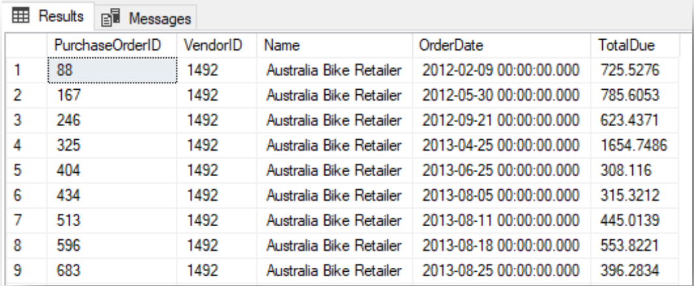

# Week 4  
- [11. Common Table Expressions](#11-common-table-expressions) 
- [12. Data Retrieval](#12-data-retieval)

## 11. Common Table Expressions  
### Part 1: CTE (Common Table Expressions)  
  
1. Write a query that defines a CTE named `"Sales_CTE"`, which is based on the `OrderHeader` table, and contains the following columns:  Order Number, SalesPersonID, the year in which the order was placed.  

  Analyze only the data that has a value in the SalesPersonID column. Use the CTE you defined, and write a query that shows the amount of orders that each salesperson generated each year. 
  
  Sort the query results by SalesPersonID and year.  
  
  Note: With the results of the query, it is possible to evaluate the salespeople's performance, and see whether the salesperson improved their performance or it needs to be strengthened.  
  
  In addition, take into account when examining the results that data is not provided for all the months in 2011 and 2014.

2. Write a query that shows the average number of orders for all the years, for all the sales people. Analyze only the data that has a value in the SalesPersonID column:  
  a. Define a CTE named "Sales_CTE", which is based on the Order header table, and contains the following columnsSalesPersonID, the amount of orders generated by the salesperson.  
  b. WriteaquerybasedontheCTEthatdisplaystheaverageorderquantityof all the salespeople.  
    
3. WriteaquerythatdefinesaCTEnamed"Person_CTE",whichisbasedonthe Sales.Customer and Person.Person tables and contains the following columns: CustomerID, first name and last name.  
  
  The purpose of the CTE is to make it easier for us to link the Sales.SalesOrderHeader table to the Person.Person table.  
  
  Use the Order header table and the Person_CTE that you defined to write a query that displays the order number, customer number, first name, last name, and SubTotal.

4. Write a query that displays the amount of orders per product color in 2013,sorted from highest to lowest. Use a CTE to simplify the query:  

  a. Define a CTE named "Sales_CTE", which contains the following columns: Order number, OrderDate, ProductID and OrderQty.  
  
  b. UsetheCTEandtheProducttabletodisplaytheamountofordersper product color in 2013, sorted from highest to lowest  
  
  c. Note: The query could also be solved without using a CTE. However, it helps to keep the code clean, tidy and legible when splitting the queries into parts.  
    
### Part 2: Multiple CTE's (Common Table Expressions) 

1. In order to prepare an annual order report by customer, which includes both the customer's details and the summarized sales data, proceed according to the following instructions:
  a. Define a `Person_CTE`, based on the `Sales.Customer` and `Person.Person` tables, which displays the following columns: `CustomerID`, `First name`, and `Last name`.
  b. Define a `Sales_CTE` that compiles the number of orders and SubTotals for each year and customer, in the following columns: `CustomerID`, `Year`, `Total order quantity` and `SubTotal`.
  c. Join between the two CTEs you created in the two preceding sections. Display only the data for 2012.
  d. A point to consider: Where should the filter to display only 2012 data be placed – in the query or in the CTE?

2. In order to compare the quantity of items offered and the quantity ordered for each color, write a query that displays the product color, the quantity of units of each color ordered, the quantity of order rows per color, and the quantity of items of each color offered in the Products table.
  Instruction:
    e. Define a CTE that is based on the `Orderdetails` and `Products` tables and contains the following columns: color, total order quantity and quantity of order rows.  
    f. Define a CTE that is based on the Products table only and contains the following columns: color, quantity of products per color.
    g. Use the two CTEs you defined, and display the following columns for all the colors (i.e., without colorless products): color, total order quantity, total orders, and quantity of products of this color in the Products table.
 
## 12. Data Retieval  
### Part 1 – All subjects learned so far General instructions:
• The practice begins with very simple questions that gradually increase in difficulty and complexity.
• A short description (one line) should be added before each query.
• Refer to the document containing the ERD and read the explanations about the
company's Purchase order tables carefully.
• Before starting to work, examine the tables and the data within the tables, and make sure that you understand the data, their significance and the connections between the tables in the ERD.

Research Question
The purpose of this interim practice is to examine the topic of orders from vendors.
In this practice, you will write queries that will answer the following business questions:
• Who are the main vendors of the store?
• Are there any vendors who supply more than one product? Which products?
• Which vendors do not deliver a large percentage of the order?
• Are there products supplied by more than one vendor ? Which vendors have the fastest average delivery time?
• Etc.

The analysis
1. Write a query that displays the `BusinessEntityID`, Vendor name and Account number from the Vendor table. Examine the query results. How many records are there in the table?  
  
  
  
2. Write a query that displays the `BusinessEntityID`, Vendor name and Account number from the Vendor table for vendors whose names end with the word "Company".  
  
  
  
3. Write a query that displays the `PurchaseorderID`, `VendorID`, `Orderdate`,and total cost per order from the Purchase order header table.  
  
  
  
4. Continuing from the previous section, add also thevendor's name to the table. Consider which table can provide the vendor name, and which kind of table connection should be used. (Check the different JOIN types, and whether all the vendors appear in the Vendor table.)  
  
  
  
5. Continuing from the previous question, add also the account number from the Vendors table. Display only the orders issued in 2012, and only those from vendors whose account numbers begin with the letters A-I and end with the number 2.  In order to filter by vendor name, must the "vendor name" field be chosen in select, as well?  
  
  
  
6. For each vendor, display the purchase orders that we reordered from them in 2012-2013.
  a. Display the following columns: Purchase order ID, Vendor ID, Vendor name, Order date, and total cost per order.
  b. Sort by VendorID and date ina scending order. 
   

7. Write a query that collects the following data from the Purchaseorderheader table for each vendor: Vendor ID, Order Amount and total cost for all orders. Sort the results by total cost per order in descending order.

8. Continuing from the previous question, add a column with the total amount of items stocked from each vendor. Note that the quantity of items entered into stock (StockedQty) is in the Purchasing.PurchaseOrderDetail table. Consider how best to add the required column. Hint: Sub-query or CTE  

9. Write a query that displays the vendor for each product. If there are two vendors for the same product, the product will appear twice in the list: once for the first vendor and a second time for the second vendor.

10. Continuing from the previous question, display the number of different products that each vendor supplies. Instruction: Before beginning to solve, consider how to arrive at the query results and plan the method.

11. Write a query that displays, the Purchase order ID, the ShipMethodID and the Name of the shipping method of each purchase order.    

12. Continuing from the previous question, display the total number of orders shipped by each shipping method. Display the following columns: ShipMethodID, Shipping method Name, Number of Orders shipped by this method. Sort by number of orders shipped by this method in descending order.  
  
  
  
13. Continuing from the previous question, copy the query and add that only the shipping methods used for more than 500 orders will be displayed.  

  
14. Continuing from the previous question, display only the shipping methods used for more than one quarter of the orders.  
  

 

15. Write a query that displays all the order records for the year 2012, and how many items are missing in each order record.  
  a. Display the following columns: Vendor ID, Product ID, OrderQty, Quantity of items missing out of the quantity ordered. (A calculated field. The fields required for the calculation are: Quantity ordered and Stocked Quantity.)
  b. Sort by VendorID in ascending order.

16. Continuing from the previous question, copy the previous query, adding that only the order records in which all the ordered items were not provided will be displayed.  
  

17. Continuing from the previous questions, write a query that displays the Vendor ID, the quantity of items ordered from them and the quantity items that they failed to deliver for each vendor from whom items were ordered in 2012. Sort by the number of missing items in descending order.  
  

18. Continuing from the previous question, calculate the percentage of items not delivered out of all the items ordered from the vendor.
  a. Display the following fields: Vendor ID, total quantity of items ordered, total quantity of missing items, percentage of missing items from all the items ordered (calculated column).
  b. Hint: The formula for the percentage of missing items from the ordered items: (lack_amount) / (Total_ordered _amount) * 100.
  c. Display only vendors who were short.
  d. Sort the data by the missing percentage in descending order.  
    

19. Write a query that shows how many items of each product (ProductID) were stocked (StockedQty). Sort by quantity stocked in descending order.  

20. Continuing from the previous question, display also the product name (from the Production.Product table.)

21. In this question, the vendors will be sorted into 4 groups according to the quantity of items purchased from them. In this way we can distinguish who are the main vendors of the store. The groups will be formed to have the same number of suppliers in each group. Write a query that displays the Vendor ID, the total cost of the products purchased from them (in all the years), and Group (Group 1 = the vendors who supplied the highest amount, Group 4 = the vendors who supplied the lowest amount). Hint: Window function - ntile

22. Continuing from the previous question, rank the vendors annually according to the amount purchased from them.
  a. Display the following fields: Vendor ID, year, total cost of items purchased from the vendor, vendor ranking according to total cost of items in descending order (1 = the highest amount purchased in that year).  Hint: Window function - rank / dense_rank
  b. Display a row for each vendor and year (i.e., vendor number 1 - year 2011; vendor number 1 - year 2012; etc.)
  c. Sort by vendor ID.

23. For each purchase order from a vendor, display the following columns: Purchase order ID, Vendor ID, OrderDate, DueDate, number of days for the arrival of the shipment (calculated column: Due date - Order date) Sort by number of days for the arrival of the shipment in descending order.

24. Continuing from the previous question, display the average days for the arrival of the shipment for each vendor.  

  

